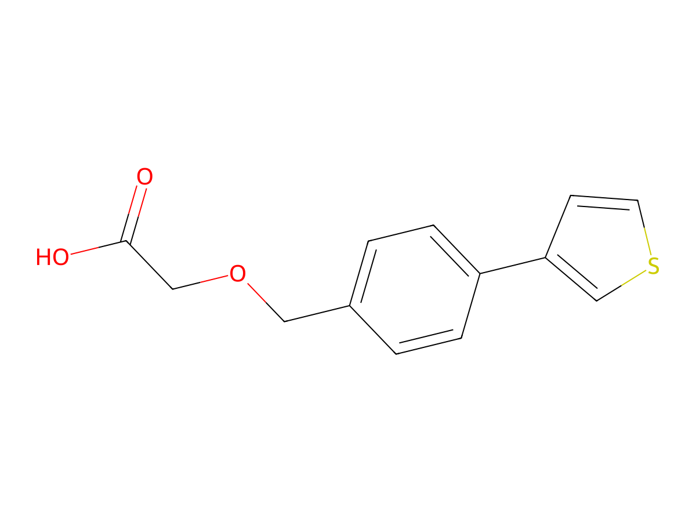
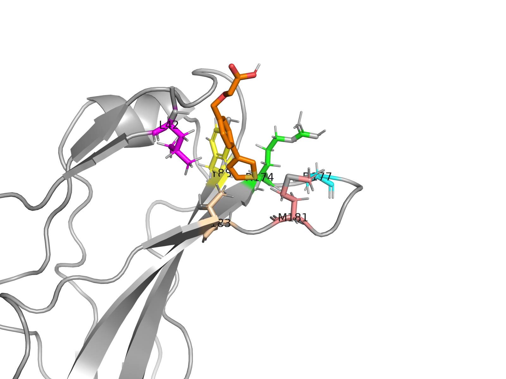
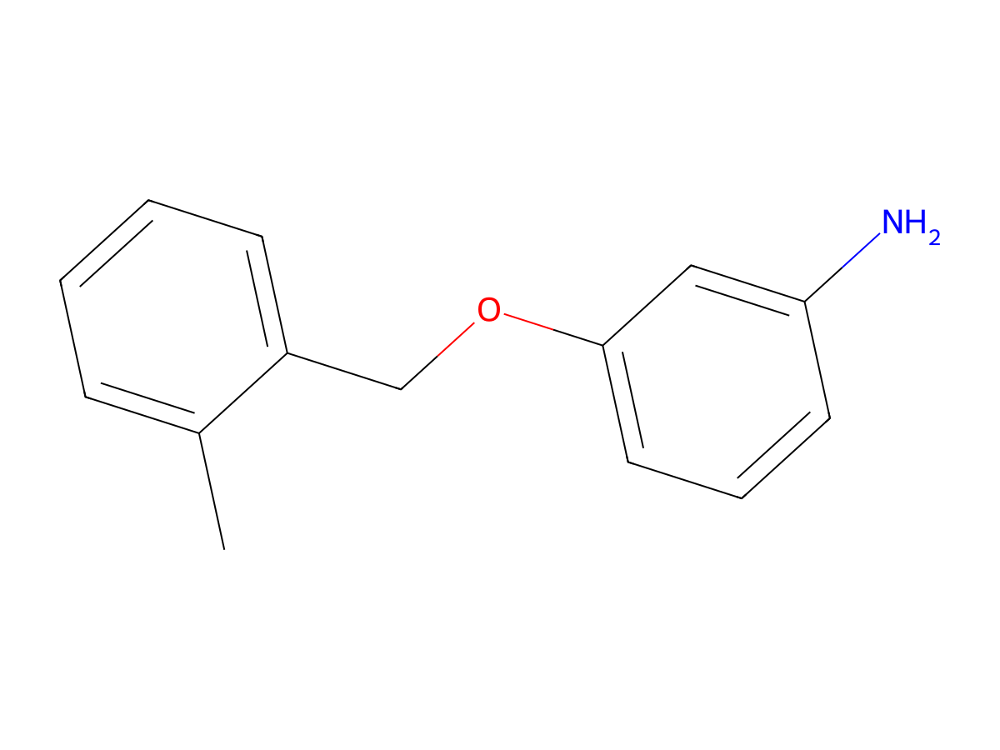
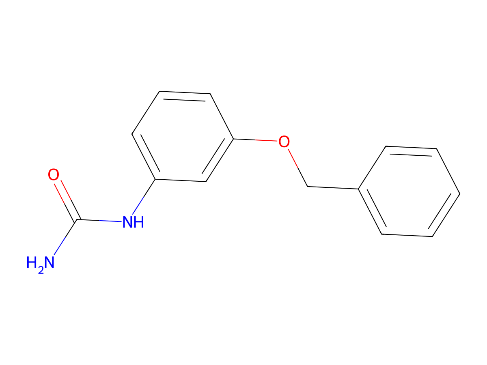
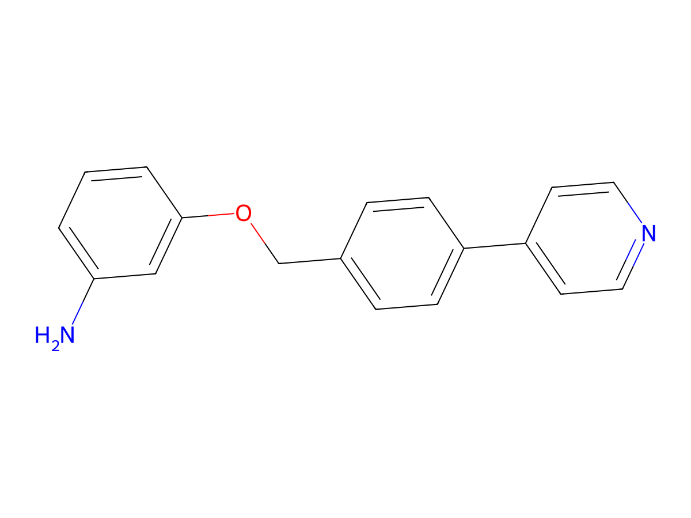

# TBXT Hit Identification — Top 4 Picks

**Multi-signal consensus pipeline for chordoma's master regulator**

TBXT Hackathon, Pillar VC Boston · 2026-05-09

Target: TBXT G177D (Brachyury) · PDB 6F59 chain A · Site F (Y88 / D177 / L42)

---

## What we built

**570-compound novelty-filtered pool** scored on **6 orthogonal signals**:

| Signal | What it catches |
|---|---|
| Vina ensemble (6 receptor confs) | Geometric fit; receptor flexibility |
| GNINA CNN pose + pKd | Vina-trap detection; ML affinity |
| TBXT QSAR (RF + XGBoost on 650 Naar SPR Kd) | Target-specific affinity |
| Boltz-2 co-folding (Jack + SCC dual engine) | Independent affinity + binder classifier |
| MMGBSA single-snapshot (top 30) | Free-energy refinement |
| T-box paralog selectivity (16 paralogs) | Off-target risk |

**Final hard gate (T-0):** 100% onepot.ai exact match · strictly non-covalent · Tanimoto < 0.85 to organizer DBs

---

## Why this filter chain (judging axis: scientific rationale)

7-criterion filter applied to every compound:

C1 onepot 100% catalog match · C2 non-covalent · C3 Chordoma rule (MW ≤ 600, LogP ≤ 6, HBD ≤ 6, HBA ≤ 12) · C4 lead-like ideal (10–30 HA, HBD+HBA ≤ 11, < 5 rings, ≤ 2 fused) · C5 PAINS-clean + no acid halides / aldehydes / diazo / imines / polycyclic > 2 fused / long alkyl · C6 Tanimoto < 0.85 to Naar / TEP / prior_art · C7 ESOL log S > -5

**Of 570 pool compounds → 137 pass all 7 criteria → 4 picks (ranks 1, 2, 11, 22)**

Tiered (T1 GOLD: 0 — empty by design, honest finding · T2 SILVER: 16 · T3 BRONZE: 89 · T4 RELAXED: 32)

---

## The 4 picks (all 100% onepot, all non-covalent, all site F)

| # | ID | Boltz Kd Jack/SCC | gnina Vina/pKd | onepot $ | risks |
|---:|---|---:|---:|---:|:---:|
| **1** | `FM002150_analog_0083` | **3.2 / 3.26 µM** | -5.01 / 3.94 | $125 | low/low |
| **2** | `FM001452_analog_0104` | **3.7 / 4.97 µM** | -5.77 / 4.03 | $250 | med/med |
| **3** | `FM001452_analog_0201` | 8.16 / 8.76 µM | **-6.07 / 4.69** | $375 | high/med |
| **4** | `FM001452_analog_0171` | 8.32 / 8.17 µM | -6.19 / 4.44 | $250 | med/med |

**Total cost to source:** $875 · **Site F coverage:** 4/4 · **Dual-engine Boltz agreement:** 1.01-1.34× across all picks

---

## Pick 1: FM002150_analog_0083

**SMILES:** `O=C(O)COCc1ccc(-c2ccsc2)cc1`

- **Strongest predicted Boltz Kd** (3.2 µM) of any 100%-onepot non-covalent compound; dual-engine 1.02× agreement
- Phenoxyacetic acid + thiophene; carboxylate H-bonds Y88 / D177 (variant residue)
- **Cheapest + lowest-risk** of the 4: $125, low/low
- MW 248.3, logP 3.02, HBD 1, HBA 4 — clean lead-like profile

 

---

## Pick 2: FM001452_analog_0104

**SMILES:** `Cc1ccccc1COc1cccc(N)c1`

- **Cleanest medchem in the pool** — minimal heteroatom decoration
- Methyl-phenyl-CH2-O-aniline; aniline-N H-bonds D177
- Mass-efficient (MW 213.3) — best fragment-like starting point for SAR
- Boltz Kd 3.7 / 4.97 µM (1.34×); $250 medium-risk

 

---

## Pick 3: FM001452_analog_0201 — urea / benzyl ether for R174 + D177

**SMILES:** `NC(=O)Nc1cccc(OCc2ccccc2)c1`

- N-aryl urea + benzyl ether: H-bond-donor / acceptor pair targeting R174 + D177 specifically
- **Deepest Vina pose** (-6.07) + **highest gnina CNN-pKd** (4.69) of the 4
- Adds urea-linker chemotype diversity to pick set
- $375, high chem risk (urea synthesis), medium supplier risk

 

---

## Pick 4: FM001452_analog_0171 — pyridyl selectivity probe

**SMILES:** `Nc1cccc(OCc2ccc(-c3ccncc3)cc2)c1`

- Pyridyl introduces basic-N for selectivity probing — may differentiate TBXT from T-box paralogs
- **Highest prob_binder (0.46)** of the 4
- **Tightest dual-engine Boltz agreement (1.02×)** — most reproducible Kd prediction
- $250, medium / medium risks; logP 3.91

 

---

## Cross-validation (judging axis: rigor)

- **Two independent Boltz runs** (Jack local + SCC re-run): 4/4 picks agree within 1.34×
- **Rowan ADMET** (49 properties × 4): all 4 ADMET-profiled
- **Rowan pose-analysis MD** (explicit-solvent, 5 ns × 1 traj + 1 ns equil): protein-ligand RMSD trajectories for the 4 picks (results in `evidence/rowan_pose_md_<id>.json`)
- **Onepot.ai catalog** (muni `onepot` tool): all 4 at similarity = 1.000 with price + chemistry_risk + supplier_risk

---

## Tradeoffs we made (judging axis: hit ID judgment)

- **All 4 site F** — gives up site-A diversity. Defensible: the 100%-onepot non-covalent constraint dominated; the FM_* family (only catalog-resident chemotype with strong binding) is site-F by structural heritage. Site-A backups documented in `top5to24_rationale.md` and `all_candidates_tiered.csv`.
- **T1 GOLD tier intentionally empty** — no compound simultaneously hits Kd ≤ 5 µM AND low/low risk. We surface this honestly rather than overclaim.
- **Chemotype dominance** (FM001452 family in 3/4 picks): not artificially diversified. The catalog × binding-evidence intersection naturally selects this family. The 20 additional submissions (`top5to24.csv`) widen to FM002150 + opv1 chemotypes.

---

## Honest expectations

- Public methods over-predict Kd by **6-25×** at µM regime → realistic SPR for these 4: **18-200 µM range**
- Hackathon judging prize ($250 muni credits): **strong shot** — multi-signal + filter chain + tier methodology directly maps the 3 judging axes
- **Experimental $100K @ Kd ≤ 1 µM:** plausible long-shot — best Boltz prediction is 3.2 µM
- **Experimental $250K @ Kd ≤ 300 nM:** unlikely without further hit-to-lead optimization

---

## Reproducibility + bundle

- **GitHub:** `git@github.com:anandsahuofficial/Hackathon.git` branch `TBXT`
- **Single-command setup:** `bash TBXT/setup_hf.sh`
- **All 24 team picks** (top 4 + 20 additional): `TBXT/final/top4.csv` + `TBXT/final/top5to24.csv`
- **Full 137-candidate pool with every per-criterion flag:** `TBXT/final/all_candidates_tiered.csv`
- **Rationale + tier explanations:** `TBXT/final/top4_rationale.md` + `TBXT/final/tiered/TIERED_CANDIDATES_RATIONALE.md`

---

## Q&A

(See `TBXT/dashboard/ON_DAY_TALKING_POINTS.md` — lead-only)
